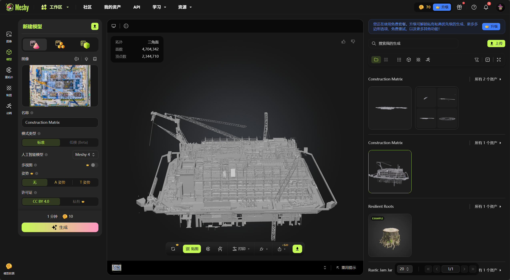
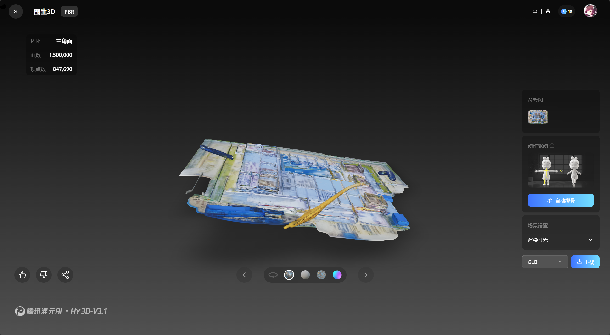
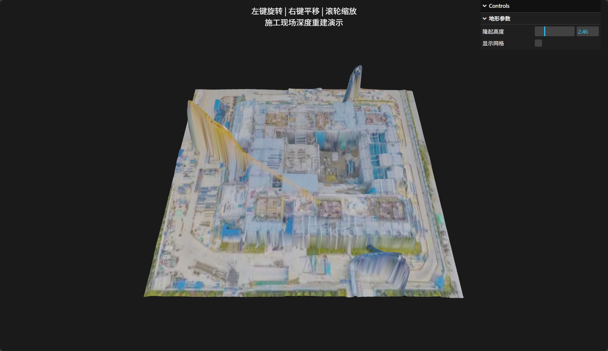

## 1. 项目背景与问题陈述
目前项目数据源受限，仅拥有一张施工现场的低清俯视航拍图。目标是基于此单一数据源，探索通过 AI 技术生成 3D 模型或 2.5D 可视化场景的可行性方案，以用于项目演示及初步的空间展示。

针对“单张图片”这一限制条件，本方案调研了当前计算机视觉与图形学领域的两类主流技术路径：**生成式 AI (Generative AI)** 与 **深度估计 (Depth Estimation)**，并对未来的多数据源方案进行了规划。

---

## 2. 方案一：生成式 AI 三维重建 (Generative 3D)

该类技术利用在大规模 3D 数据集（如 Objaverse）上训练的 AI 模型，通过“联想”和“补全”单张图片中不可见的侧面和背面信息，直接生成 `.obj` 或 `.glb` 格式的三维模型。

针对当前开源社区及业界的主流模型，进行了以下对比测试：

### 2.1 主流模型评估

#### (1) Meshy (SaaS/Web端) 能生成看起来还不错的模型
* **特点**：目前商业化程度最高的单图转 3D 服务。采用“粗生成 + 精细化 (Refinement)”的两阶段策略。
* **优势**：模型纹理清晰，PBR 材质（光影反射）处理得当，生成的网格拓扑结构较好（布线规范），视觉观感最佳。
* **局限**：作为 SaaS 服务需付费且数据需上传云端；生成时间较长（精修需 5-10 分钟）；本质上是针对“物体”训练的，对于“大场景”容易出现边缘强行闭合（把工地变成一个岛屿）的现象。

#### (2) Stable Fast 3D (开源 - Stability AI) 没尝试，不过考虑到这个生成速度多半是不太行
* **特点**：主打极致速度的前馈网络模型。
* **优势**：**极速**，单张图生成仅需 0.5 秒左右；完全开源，支持本地部署。
* **局限**：为了速度牺牲了精度，几何结构较为粗糙，细节容易丢失（出现“融化”感）；对 AMD 显卡支持不佳；适合做游戏背景资产，不适合做主体工程展示。

#### (3) Tencent Hunyuan3D (开源 - 腾讯混元) 实测无法生成可用模型
* **特点**：国产开源的高精度模型，采用“多视角生成 + 显式重建”的技术路线。
* **优势**：**结构准确性高**。相比于 SF3D 的“瞎猜”，Hunyuan3D 在保持物体几何结构不发生畸变方面表现更优，生成的模型表面更平整，减少了非自然的凹凸。
* **局限**：对显存资源有一定要求，推理时间长于 SF3D。

### 2.2 小结
生成式 AI 的核心问题在于 **“幻觉”**。由于缺乏真实的多角度数据，AI 生成的侧面和遮挡区域是基于概率预测的（即“脑补”），无法满足工程测量的精度要求，仅适用于概念展示。

---

## 3. 方案二：基于深度估计的 2.5D 可视化 (推荐)

鉴于施工图为“俯视视角”，相比于生成完整的 3D 模型，利用**深度图（Depth Map）** 进行 **置换（Displacement）** 建模是更符合工程逻辑的方案。该方案不瞎编乱造侧面信息，而是基于像素明暗恢复地形起伏。

### 3.1 核心技术：Depth Anything V2
* **模型介绍**：当前最先进的单目深度估计（Monocular Depth Estimation）模型之一。
* **原理**：输入 RGB 彩色图像，模型输出一张灰度图（高程图），其中白色代表高点（如塔吊顶端），黑色代表低点（如基坑底部）。
* **优势**：
    * **鲁棒性强**：对复杂场景（如混乱的施工现场）的层次理解非常准确。
    * **可控性**：输出的深度图可直接用于 Three.js、Cesium 或 Blender 中的置换贴图。
* **局限**：
    * 假3D，并非真正的3D模型，不能看侧面，只有正面能看

### 3.2 原型验证：施工现场 2.5D 可视化 Demo
基于 `Three.js` 引擎与 `Depth Anything V2` 生成的深度图，做了一个 Web 端可视化原型。该 Demo 实现了对平面照片的“立体化”展示，模拟基坑深度与塔吊高度。

[Demo地址](https://blog.xfkun233.cn/depth-demo/)

*注：该方案由于是基于单视角的几何拉伸，侧面会有纹理拉伸现象，但能最真实地反映照片中的相对位置关系。*

---

## 4. 进阶方案：多视角数据采集与重建

若后续能够获取施工现场的**无人机环绕视频**或**多角度照片组**，可以不再依赖 AI 的“猜想”，而是转向高精度的**实景建模（Photogrammetry）** 或 **三维高斯泼溅（3DGS）** 方案。这将满足工程级（Engineering Grade）的精度需求。

### 4.1 传统摄影测量 (Photogrammetry)
* **推荐工具**：ContextCapture (CC) / Colmap / RealityCapture
* **原理**：利用三角测量原理，计算相机位姿和稀疏点云，重建致密网格。
* **适用性**：能够生成带坐标信息的 Mesh 模型，可直接导入 BIM 软件进行土方计算、进度比对。

### 4.2 AI 辅助多视图重建 (AI-Assisted MVS)
* **推荐工具**：DUSt3R (Dense Unconstrained Stereo 3D Reconstruction)
* **技术前沿**：无需复杂的相机参数校准，直接将多张照片输入模型，AI 自动回归出高精度的点云结构。
* **优势**：在数据量较少（如仅有 3-5 张不同角度照片）的情况下，效果远优于传统摄影测量软件。

---

## 5. 总结与建议

1.  **当前阶段（仅单张图）**：建议采用 **Depth Anything V2 + Three.js** 的方案。该方案避免了生成式 AI 的几何幻觉，能够快速实现具备立体感的可视化 Demo，适合网页端展示，关键还不要钱。
2.  **未来规划**：若需更进一步，需要获取多角度影像数据，并采用 **DUSt3R** 或 **ContextCapture** 进行真实的物理重建。